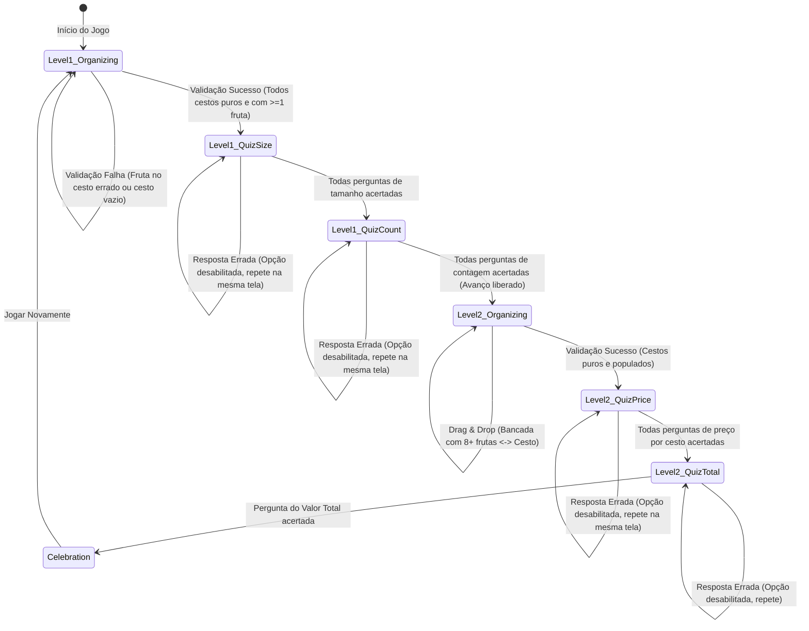

# Phase 1 Data Model: Aprendendo com as Frutas

**Feature**: `001-aprendendo-frutas`  
**Date**: 2026-09-30  
**Status**: Completed  

---

## 1. Entidades de Domínio

### 1.1 `FruitDefinition` (Catálogo Botânico Fixo)
Define as propriedades fundamentais de cada espécie de fruta regional:

```javascript
{
  id: "acai",              // "acai" | "buriti" | "manga" | "cupuacu" | "jaca" | "melancia"
  name: "Açaí",            // Nome de exibição
  category: "pequena",     // "pequena" | "media" | "grande"
  price: 1,                // Preço unitário em R$ no Nível 2
  image: "assets/images/acai.png",
  audioText: "Açaí",
  audioFallback: "assets/audio/acai.mp3",
  scaleClass: "fruit-small" // "fruit-small" | "fruit-medium" | "fruit-large"
}
```

Tabela canônica de espécies:
| ID | Nome | Categoria | Preço (Nível 2) | Proporção Visual |
| :--- | :--- | :--- | :--- | :--- |
| `acai` | Açaí | Pequena | R$ 1,00 | Pequeno (48px) |
| `buriti` | Buriti | Pequena | R$ 2,00 | Pequeno (52px) |
| `manga` | Manga | Média | R$ 3,00 | Médio (72px) |
| `cupuacu` | Cupuaçu | Média | R$ 4,00 | Médio (78px) |
| `jaca` | Jaca | Grande | R$ 5,00 | Grande (100px) |
| `melancia` | Melancia | Grande | R$ 10,00 | Grande (110px) |

---

### 1.2 `BenchSlot` (Slot Físico na Bancada da Feira)
Representa um nicho fixo da bancada de madeira onde a fruta repousa:

```javascript
{
  slotId: "slot-01",       // Identificador único do slot na bancada
  fruitId: "manga",        // Espécie de fruta alocada originalmente
  instanceId: "fruit-101", // ID único da instância da fruta
  isOccupied: true         // true: fruta presente | false: fruta retirada (espaço vazio)
}
```

---

### 1.3 `Basket` (Cesto de Palha)
Representa um dos 6 cestos de palha onde o aluno deposita as frutas:

```javascript
{
  basketId: "basket-manga",
  targetFruitId: "manga",  // Espécie correta esperada neste cesto
  name: "Manga",           // Rótulo textual visível
  items: [                 // Lista de instâncias de frutas contidas
    {
      instanceId: "fruit-101",
      fruitId: "manga",
      originSlotId: "slot-01"
    }
  ],
  isPure: true,            // true se todos os items possuem fruitId === targetFruitId
  hasMinimumItems: true    // true se items.length >= 1
}
```

---

### 1.4 `QuizQuestion` (Pergunta de Avaliação Matemática)
Representa um desafio de classificação, contagem ou precificação:

```javascript
{
  id: "q-01",
  type: "count",           // "size_class" | "count" | "basket_price" | "total_price"
  fruitId: "buriti",       // ID da fruta relacionada (se aplicável)
  prompt: "Quantas frutas Buriti estão no cesto?",
  options: [               // Exatamente 3 alternativas
    { id: "opt-1", label: "3", value: 3, isCorrect: false },
    { id: "opt-2", label: "5", value: 5, isCorrect: true },
    { id: "opt-3", label: "7", value: 7, isCorrect: false }
  ],
  disabledOptions: [],     // IDs das opções desabilitadas por tentativas incorretas
  isAnswered: false,
  explanation: "Havia exatamente 5 buritis colocados no cesto."
}
```

---

### 1.5 `GameState` (Máquina de Estados Global da Sessão)
Representa o estado completo da aplicação em memória:

```javascript
{
  currentLevel: 1,         // 1 ou 2
  phase: "ORGANIZING",     // "ORGANIZING" | "QUIZ_SIZE" | "QUIZ_COUNT" | "QUIZ_PRICE" | "CONGRATULATIONS"
  benchSlots: [],          // Array de BenchSlot
  baskets: {},             // Map de basketId -> Basket
  quizQueue: [],           // Fila de QuizQuestion do nível atual
  currentQuestionIndex: 0,
  trophyAwarded: false,
  audioMuted: false
}
```

---

## 2. Diagrama de Transição de Estados (FSM)



---

## 3. Regras de Invariância e Validação

1. **Invariância de Conservação Espacial**:
   - $\text{TotalSlotsOcupados} + \sum \text{ItensNosCestos} = \text{TotalFrutasInicial}$.
   - O número de posições físicas na bancada é estático; ao retirar uma fruta, o `slotId` torna-se `isOccupied: false` e nenhuma outra fruta se move.
2. **Invariância de Opções de Quiz**:
   - $\forall q \in \text{QuizQuestion}, \text{length}(q.\text{options}) = 3$.
   - $\sum_{opt \in q.\text{options}} [opt.\text{isCorrect} = \text{true}] = 1$.
   - $\forall i \neq j, q.\text{options}[i].\text{value} \neq q.\text{options}[j].\text{value}$.
3. **Invariância de Avanço de Nível**:
   - `canAdvanceToNextLevel` é `true` **SE E SOMENTE SE**:
     - $\forall b \in \text{baskets}, b.\text{isPure} = \text{true} \land b.\text{hasMinimumItems} = \text{true}$.
     - $\forall q \in \text{quizQueue}, q.\text{isAnswered} = \text{true}$ com acerto final.
