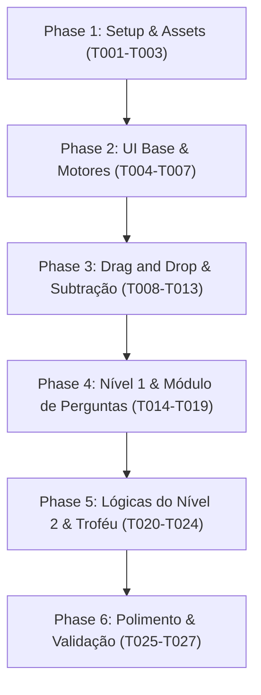

# Tasks: Aprendendo com as Frutas

**Input**: Design documents from [`specs/001-aprendendo-frutas/`](.) (`spec.md`, `plan.md`, `data-model.md`, `research.md`, `contracts/game-schema.json`, `quickstart.md`)  
**Prerequisites**: `plan.md` (concluído), `spec.md` (concluído), `constitution.md` (ratificado v1.0.0)  
**Status**: Implementação Concluída com Êxito (100%)  
**Organization**: As tarefas estão rigorosamente agrupadas na sequência lógica de desenvolvimento:
`Setup & Assets` ➔ `Estruturar UI Base` ➔ `Mecânica de Drag and Drop` ➔ `Módulo de Perguntas (Nível 1)` ➔ `Lógicas do Nível 2 & Precificação` ➔ `Polimento & Troféu`.

## Format: `[ID] [P?] [Story] Description`
- **[P]**: Tarefa paralelizada (arquivos independentes, sem bloqueios mútuos).
- **[Story]**: Mapeamento para a respectiva História de Usuário (`[US1]`, `[US2]`, `[US3]`).
- Todos os caminhos de arquivos estão explicitados.

---

## Phase 1: Setup & Assets (Estrutura e Recursos Iniciais)

**Purpose**: Criação da infraestrutura de diretórios estáticos e banco de ativos visuais e sonoros.

- [x] T001 Criar estrutura de diretórios estáticos do projeto em `assets/images/` e `assets/audio/`
- [x] T002 [P] Gerar/adicionar ilustrações realistas e naturalistas de alta fidelidade para as 6 frutas regionais (Açaí, Buriti, Manga, Cupuaçu, Jaca e Melancia), cesto de palha artesanal e troféu "Saber Matemático" em `assets/images/`
- [x] T003 [P] Configurar arquivos de áudio de fallback e efeitos sonoros encorajadores para acertos e erros em `assets/audio/`

---

## Phase 2: Foundational (Estruturar UI Base & Motores Centrais)

**Purpose**: Construção da interface semântica base, estilização responsiva de feira e infraestrutura de estado e voz que sustentam todas as histórias de usuário.

- [x] T004 Criar a estrutura semântica HTML5 acessível contendo cabeçalho da feira, bancada de madeira com slots fixos, área de 6 cestos de palha com rótulos, container de modais de quiz e container do troféu comemorativo em `index.html`
- [x] T005 [P] Implementar o layout responsivo com CSS Grid e Flexbox, paleta visual de feira brasileira, estilos de bancada, nichos vazios e alvos de toque mínimos de 48x48px para mobile em `styles.css`
- [x] T006 [P] Definir o catálogo de dados `FruitCatalog` com as 6 espécies (categorias, proporções e preços) e a máquina de estados `GameState` em `app.js`
- [x] T007 Implementar o módulo `SpeechManager` utilizando a Web Speech API (`pt-BR`, voz feminina didática, `rate: 0.9`, `pitch: 1.1`), suporte a cancelamento de locuções prévias e fallback de áudio em `app.js`

**Checkpoint**: Interface base renderizada com visual atraente, responsivo e motor de áudio pronto para interação.

---

## Phase 3: User Story 1 - Mecânica de Drag and Drop & Subtração Concreta (Priority: P1) 🎯 MVP

**Goal**: Permitir que o aluno pegue frutas na bancada ouvindo o nome da fruta no evento `onDragStart` e as solte nos cestos de palha, conservando o espaço vazio na bancada (subtração concreta) de forma reversível.  
**Independent Test**: Carregar a bancada, iniciar o arraste de qualquer fruta (testando áudio da voz feminina), soltá-la em um cesto de palha, verificar se a vaga na bancada permaneceu visivelmente vazia (`.empty`), e depois arrastar a fruta de volta do cesto para a bancada confirmando a reversibilidade da ação.

### Implementation for User Story 1

- [x] T008 [P] [US1] Implementar gerador e renderizador de slots fixos da bancada preservando posições absolutas na grade sem reflow em `app.js`
- [x] T009 [US1] Implementar manipuladores da API nativa HTML5 Drag and Drop (`dragstart`, `dragend`, `dragover`, `drop`) nos elementos de frutas e nos cestos de palha em `app.js`
- [x] T010 [US1] Implementar suporte unificado a Pointer/Touch Events (`pointerdown`, `pointermove`, `pointerup`) para garantir suporte a telas de tablets e smartphones sem depender de mouse em `app.js`
- [x] T011 [US1] Conectar o evento `onDragStart` (ou início de ponteiro) ao `SpeechManager.speakFruitName(fruitId)` para acionar a voz feminina didática imediatamente no instante da seleção em `app.js`
- [x] T012 [US1] Implementar a lógica de subtração concreta no `drop`: marcar o slot de origem como desocupado (`.empty`), manter a vaga física no DOM sem reorganização dos outros itens e transferir a fruta para o cesto em `app.js` e `styles.css`
- [x] T013 [US1] Implementar a mecânica reversível permitindo ao aluno arrastar uma fruta de volta de qualquer cesto para um slot vazio da bancada, reocupando a vaga e decrementando o cesto em `app.js`

**Checkpoint**: MVP do jogo funcional e testável de forma autônoma. Manipulação física completa, feedback sonoro ativo e conservação visual de espaços vazios.

---

## Phase 4: User Story 2 - Nível 1: Validação de Cestos & Módulo de Perguntas (Priority: P2)

**Goal**: Configurar o Nível 1 com 1 a 6 frutas por tipo, validar a pureza dos cestos (bloqueando avanço se houver mistura) e conduzir os questionários de classificação de tamanho e de contagem com 3 alternativas e novas tentativas na mesma tela.  
**Independent Test**: Organizar frutas no Nível 1, tentar avançar com espécies trocadas (validando bloqueio), corrigir a organização, responder ao quiz de tamanho (pequena, média, grande) e ao quiz de contagem das frutas no cesto, validar que erro desabilita a opção errada sem reiniciar o jogo e que o Nível 2 é liberado com 100% de acertos.

### Implementation for User Story 2

- [x] T014 [P] [US2] Implementar a rotina de inicialização do Nível 1 sorteando e populando a bancada com quantidades entre 1 e 6 frutas de cada uma das 6 espécies em `app.js`
- [x] T015 [US2] Implementar o algoritmo de validação de cestos (`validateBaskets`), verificando pureza estrita (`isPure`) e presença mínima de 1 fruta por cesto, disparando avisos formativos em `app.js`
- [x] T016 [US2] Implementar no `QuizEngine` o gerador de perguntas de classificação de tamanho ("A fruta [Nome] é pequena, média ou grande?") com exatamente 3 opções padronizadas em `app.js`
- [x] T017 [US2] Implementar no `QuizEngine` o gerador de perguntas dinâmicas de contagem ("Quantas frutas [Nome] estão no cesto?"), calculando a resposta exata baseada nas frutas depositadas e gerando 2 distratores plausíveis distintos em `app.js`
- [x] T018 [US2] Implementar o renderizador de quiz na interface com política de tentativas múltiplas: destacar/desabilitar alternativa incorreta com aviso encorajador, manter opções restantes ativas e bloquear avanço até o acerto em `app.js` e `styles.css`
- [x] T019 [US2] Implementar a validação de conclusão do Nível 1 e o desbloqueio da transição animada para o Nível 2 em `app.js`

**Checkpoint**: Nível 1 100% jogável, avaliado e integrado com rigor pedagógico.

---

## Phase 5: User Story 3 - Nível 2: Lógicas do Nível 2, Precificação e Troféu Final (Priority: P3)

**Goal**: Inicializar o Nível 2 com $\ge 8$ frutas por espécie, executar a organização, conduzir o quiz de precificação com a tabela oficial de preços em reais e o cálculo do valor total, culminando na apresentação do troféu "Saber Matemático".  
**Independent Test**: Iniciar Nível 2 com lote expandido, organizar os 6 cestos, responder às perguntas de preço por cesto (ex.: Buriti a R$ 2,00) e à pergunta final do valor total consolidado da feira, validando o surgimento da tela de celebração com o troféu ilustrado e o título "Saber Matemático".

### Implementation for User Story 3

- [x] T020 [P] [US3] Implementar a inicialização do Nível 2 configurando a bancada com no mínimo 8 frutas disponíveis de cada uma das 6 espécies em `app.js`
- [x] T021 [US3] Integrar a tabela oficial de preços unitários (Açaí: R$ 1, Buriti: R$ 2, Manga: R$ 3, Cupuaçu: R$ 4, Jaca: R$ 5, Melancia: R$ 10) às regras do Nível 2 em `app.js`
- [x] T022 [US3] Implementar no `QuizEngine` a formulação de perguntas de precificação por cesto ("Quanto você pagará pelas frutas no cesto do [Nome]?") com 3 alternativas monetárias calculadas por `(quantidade * preço_unitário)` em `app.js`
- [x] T023 [US3] Implementar a pergunta final do valor total da feira ("Qual o valor total de todos os cestos?") somando os valores dos 6 cestos com 3 alternativas em reais em `app.js`
- [x] T024 [US3] Implementar a tela final de celebração renderizando a ilustração do troféu "Saber Matemático", mensagem de consagração e botão "Jogar Novamente" para reiniciar a sessão em `app.js` e `styles.css`

**Checkpoint**: Fluxo completo do jogo (Nível 1 + Nível 2 + Celebração) totalmente interligado e funcional.

---

## Phase 6: Polish & Cross-Cutting Concerns (Polimento Final)

**Purpose**: Acessibilidade universal, testes de responsividade em múltiplos formatos e garantia de conformidade constitucional.

- [x] T025 [P] Adicionar atributos de acessibilidade ARIA (`aria-live` para feedback sonoro e mensagens do quiz, `aria-label` e navegação por teclado) em `index.html` e `styles.css`
- [x] T026 [P] Realizar ajustes visuais finos de responsividade e layout tátil para resoluções de 360px (mobile) até 4K em `styles.css`
- [x] T027 Executar validação manual completa baseada nos 5 cenários de testes do [`quickstart.md`](quickstart.md), certificando ausência de erros no console do navegador

---

## Dependencies & Execution Order

